# 🛒 MERN E-Commerce Platform

A full-stack MERN E-Commerce application built using the MERN stack with secure authentication, product management, shopping cart, PayPal payment integration, and an admin dashboard.

---

## Live
[![E-Commerce-MERN]](https://shopecommerce-mern.netlify.app)


## 🚀 Features

### 👤 Authentication
- User Registration
- User Login & Logout
- JWT Authentication
- HTTP-Only Cookies
- Role-Based Authorization

### 🛍️ User Features
- Browse Products
- Product Search
- Category & Brand Filters
- Price Sorting
- Shopping Cart
- Address Management
- Checkout
- PayPal Payment
- Order History
- Product Reviews & Ratings

### 👨‍💼 Admin Features
- Admin Dashboard
- Add Products
- Update Products
- Delete Products
- Upload Product Images
- Manage Orders

> **Note:** Some admin features are currently under development.

---

## 🛠️ Tech Stack

### Frontend
- React.js
- Vite
- Redux Toolkit
- React Router DOM
- Tailwind CSS
- Axios

### Backend
- Node.js
- Express.js
- MongoDB
- Mongoose
- JWT
- Cookie Parser
- Helmet
- Express Rate Limit
- Multer
- Cloudinary

### Payment
- PayPal

---

## 📂 Folder Structure

```text
client/
server/
```

---

## ⚙️ Installation

### Clone Repository

```bash
git clone https://github.com/GULLAPALLIJYOTHIPRAKASH/E-commerce-MERN.git
```

### Install Dependencies

Backend

```bash
cd server
npm install
```

Frontend

```bash
cd client
npm install
```

---

## ▶️ Run Project

Backend

```bash
npm start
```

Frontend

```bash
npm run dev
```

---

## 🔐 Environment Variables

### Backend (.env)

```env
PORT=5000
MONGO_URI=
JWT_SECRET=
FRONTEND_URL=

CLOUDINARY_CLOUD_NAME=
CLOUDINARY_API_KEY=
CLOUDINARY_API_SECRET=

PAYPAL_CLIENT_ID=
PAYPAL_CLIENT_SECRET=
```

### Frontend (.env)

```env
VITE_BACKEND_API_URL=http://localhost:5000
```

---

## 🔒 Security

- JWT Authentication
- HTTP-Only Cookies
- Helmet
- Express Rate Limiter
- Password Hashing (bcrypt)
- CORS Protection

---

## 📸 Screenshots

Add screenshots of:

- Login
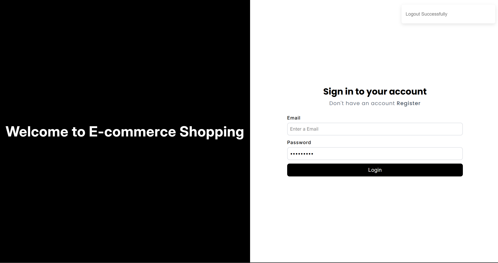


- Shop Home
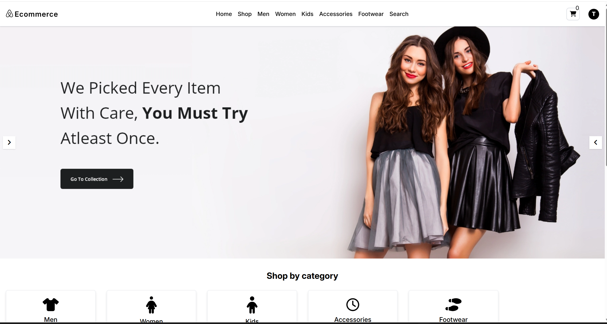

- Product Listing
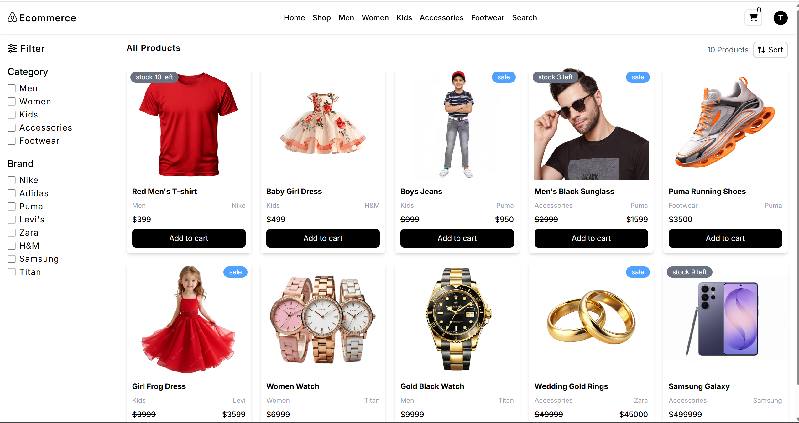

- Product Details
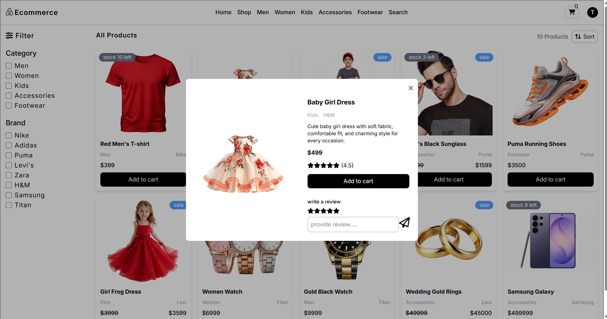

- Account - Orders & Details
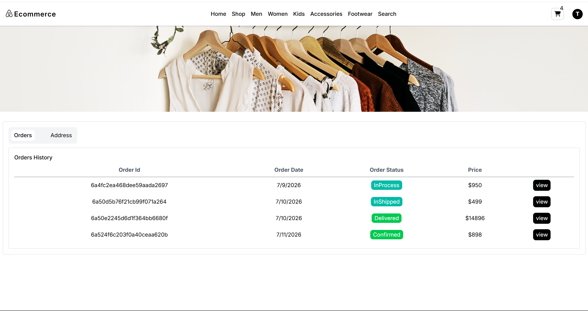
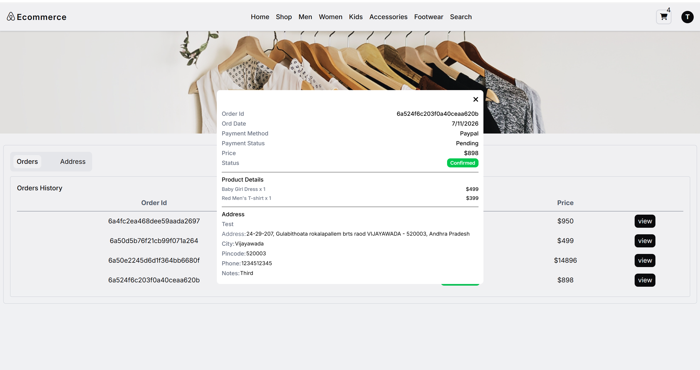

- Account - Address
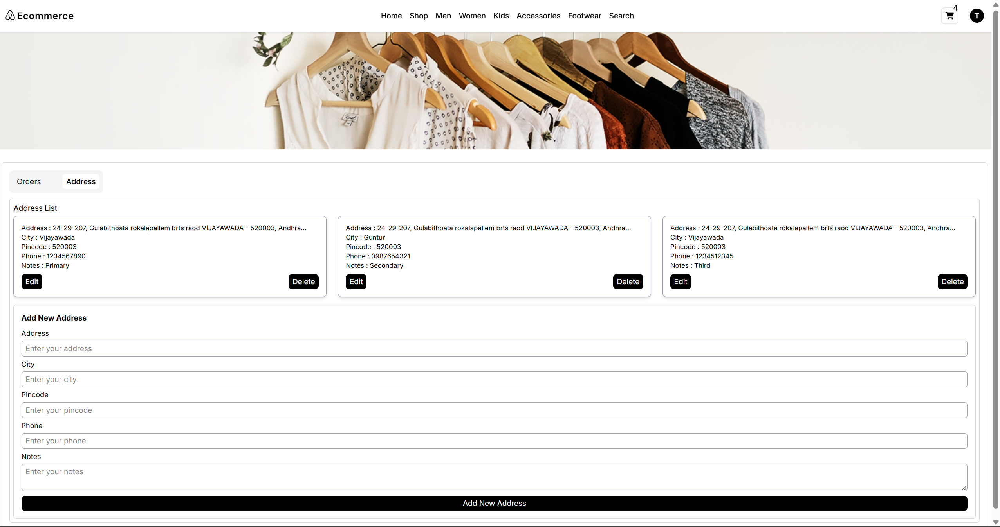

- Cart
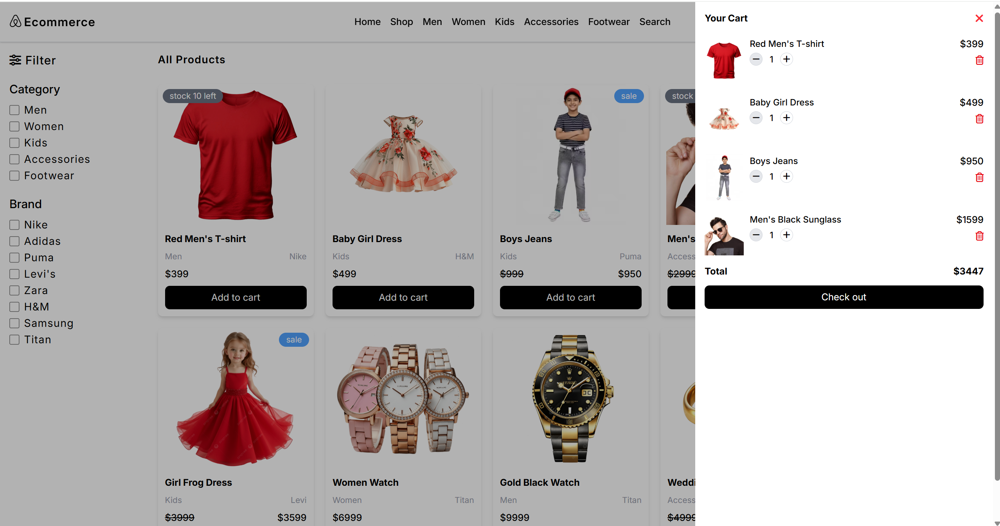

- Checkout
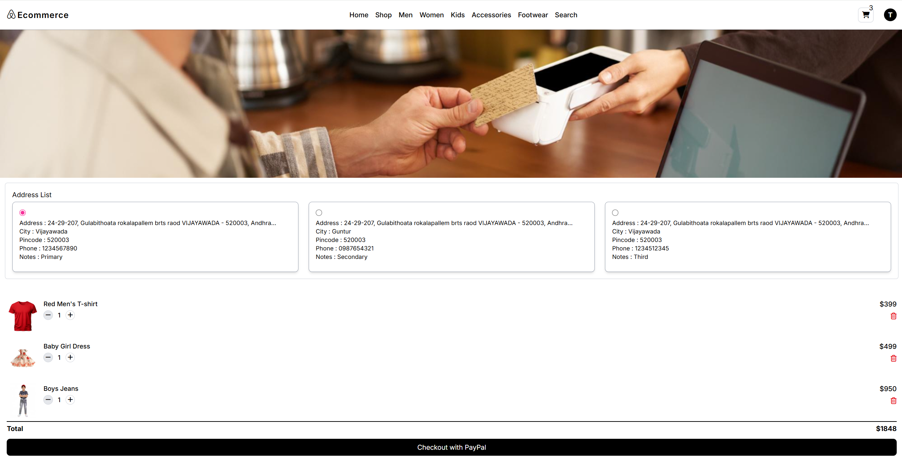


- Admin Dashboard
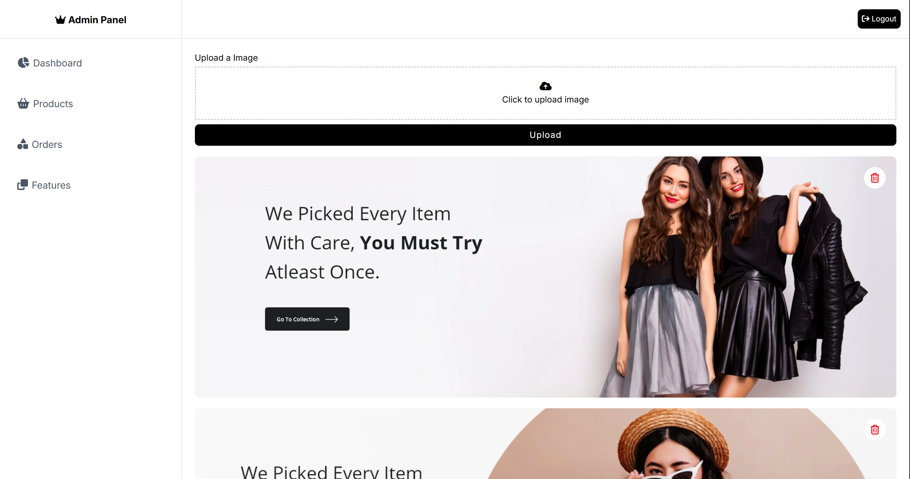


- Admin Products
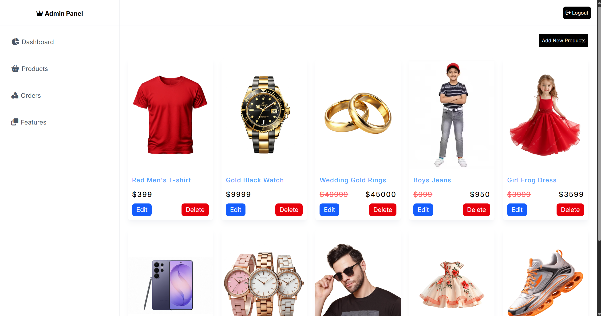


- Admin Orders
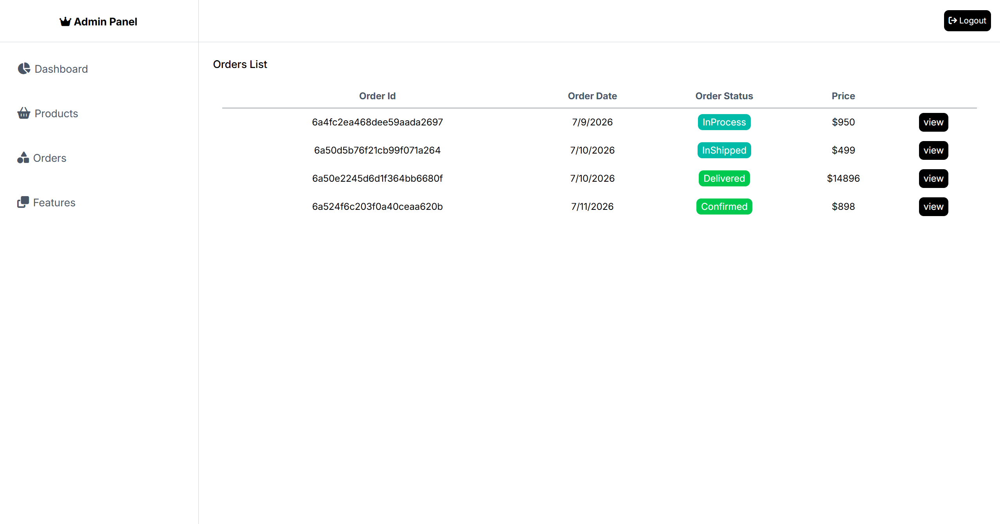


---

## 🚀 Future Improvements

- Wishlist
- Coupons
- Email Notifications
- Analytics Dashboard
- Inventory Management
- Product Recommendations

---

## 👨‍💻 Author

**Gullapalli Jyothi Prakash**

- GitHub: https://github.com/GULLAPALLIJYOTHIPRAKASH
- LinkedIn: https://www.linkedin.com/in/gullapalli-jyothiprakash/

---

## ⭐ Support

If you like this project, please give it a ⭐ on GitHub.